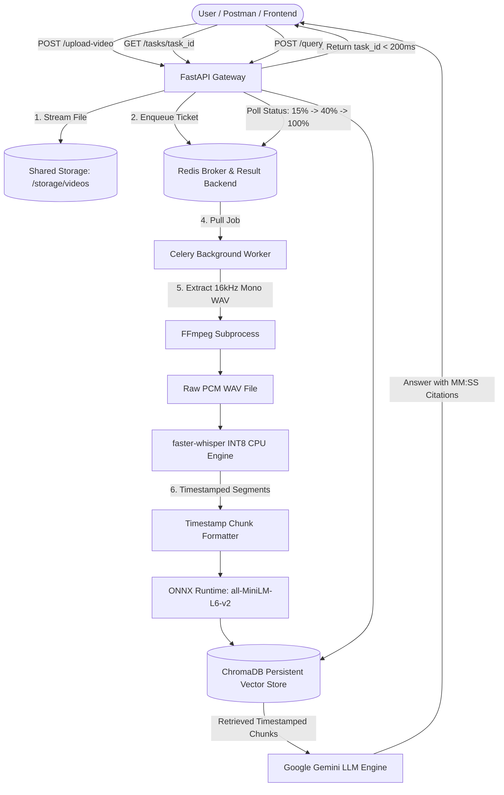

# ⚡ DocAI & Video Intelligence Engine — Distributed Asynchronous RAG Pipeline

[](https://fastapi.tiangolo.com)
[](https://docs.celeryq.dev/)
[](https://redis.io/)
[](https://www.docker.com/)
[](https://ai.google.dev/)
[](https://www.trychroma.com/)
[](https://github.com/openai/whisper)

An enterprise-grade, microservice-decoupled **Multimodal Retrieval-Augmented Generation (RAG) Engine** capable of processing large PDF/DOCX documents as well as long-form video uploads (`.mp4`, `.mkv`, `.webm`). Features an asynchronous event-driven worker queue (**Redis + Celery**), **FFmpeg** audio extraction, **INT8 quantized Whisper** speech-to-text transcription, **ChromaDB** vector storage, and **Gemini** temporal citation Q&A (`[MM:SS]`).

---

## 🌟 Key Architectural & Engineering Highlights

### 1. 🚀 Asynchronous Distributed Video Processing (Producer-Consumer Pattern)
Heavy video processing is completely decoupled from the web server thread to prevent API latency degradation or Out-of-Memory (OOM) crashes:
- **FastAPI Gateway (Producer)**: Accepts video uploads via chunked streaming (`shutil.copyfileobj`), writes to shared storage, and enqueues a lightweight JSON ticket to Redis in **$<200\text{ms}$**.
- **Redis Message Broker**: Manages queued jobs and stores task state metadata.
- **Celery Worker Pool (Consumer)**: Isolated background worker process that consumes tickets, executes FFmpeg audio extraction, and runs Whisper transcription without blocking web traffic.

### 2. 🎧 16kHz Mono Audio Extraction via FFmpeg Subprocess
Invokes an uncompressed PCM 16-bit WAV conversion (`-ar 16000 -ac 1 -vn`) via Python `subprocess`. Converting stereo/48kHz audio to 16kHz mono cuts raw audio data size by **50%** and eliminates CPU decoding overhead for the AI model.

### 3. 🧠 INT8 Quantized Local Speech Recognition (`faster-whisper`)
Utilizes `faster-whisper` on CTranslate2 CPU engine with **INT8 quantization**:
- Slashed RAM footprint by **70%** and boosted inference speed by **4x** compared to vanilla PyTorch Whisper.
- Auto-detects spoken languages (99 languages supported) with confidence scoring.
- Generates precise segment-level timestamps (`[01:15 - 01:45]`).

### 4. ⏱️ Temporal Citation Prompt Engineering
Video transcript segments are indexed into ChromaDB with explicit inline timestamp markers. Gemini is governed by strict citation rules:
> *"At [04:12 - 04:35], the speaker explains B-Trees..."*
Allows users to scrub directly to the exact moment in the video.

### 5. 🐳 Microservice Container Topology (Docker Compose)
Orchestrates 3 isolated containers over a private internal bridge network:
1. `rag_api_backend`: FastAPI Gateway
2. `rag_redis`: Redis 7 Broker
3. `rag_celery_worker`: Celery Worker with pre-cached Whisper & Chroma models
Uses volume mounts (`./storage`, `./chroma_db`) for shared host disk access.

---

## 🏗️ Architecture Diagram



---

## 🛠️ Tech Stack

| Component | Technology | Purpose |
| :--- | :--- | :--- |
| **API Gateway** | **FastAPI** | High-performance asynchronous REST routing & streaming |
| **Task Queue & Broker** | **Redis** | In-memory message broker & task state store |
| **Distributed Worker** | **Celery** | Isolated background process execution |
| **Media Processing** | **FFmpeg** | Binary subprocess audio extraction (16kHz mono WAV) |
| **Speech Recognition** | **faster-whisper** | INT8 CTranslate2 CPU model for timestamped transcription |
| **Vector Database** | **ChromaDB** | Local persistent dense vector database |
| **Embedding Engine** | **ONNX Runtime** | `all-MiniLM-L6-v2` dense vectors (384-dimensional) |
| **LLM Inference** | **Google GenAI SDK** | Resilient Gemini Flash-Lite citation engine |
| **Containerization** | **Docker & Docker Compose** | Multi-container microservice orchestration |

---

## 📡 API Endpoints

### 1. Video Ingestion & Polling

#### `POST /upload-video`
Streams video file to storage and enqueues background processing.
- **Form Data**: `file` (`.mp4`, `.mkv`, `.mov`, `.webm`, `.avi`)
- **Response ($<200\text{ms}$)**:
```json
{
  "status": "queued",
  "task_id": "39ca2ffe-f378-427a-8593-d8f986697780",
  "filename": "lecture.mp4",
  "check_status_url": "/tasks/39ca2ffe-f378-427a-8593-d8f986697780"
}
```

#### `GET /tasks/{task_id}`
Polls Celery background worker progress.
- **Response**:
```json
{
  "task_id": "39ca2ffe-f378-427a-8593-d8f986697780",
  "state": "PROCESSING",
  "progress": 40,
  "step": "Transcribing audio with Whisper"
}
```

---

### 2. Temporal Citation Querying

#### `POST /query`
Queries indexed document and video knowledge base.
- **Body**:
```json
{
  "session_id": "session_123",
  "question": "When did the lecturer explain database indexing?"
}
```
- **Response**:
```json
{
  "answer": "At [04:15 - 04:45], the lecturer explains that database indexing uses B-Trees to minimize disk block reads...",
  "sources": [
    "[04:15 - 04:45] In this section, database indexing is introduced using B-Trees..."
  ]
}
```

---

## 🚀 Quickstart (Single Command)

### Prerequisites
- [Docker Desktop](https://www.docker.com/products/docker-desktop/) installed & running.
- A [Google AI Studio Gemini API Key](https://aistudio.google.com/).

### 1. Clone & Configure
```bash
git clone https://github.com/YOUR_USERNAME/distributed-video-rag-engine.git
cd distributed-video-rag-engine

# Create .env file
echo "GEMINI_API_KEY=your_gemini_api_key_here" > .env
```

### 2. Boot the Cluster
```bash
docker compose up --build
```

Access the interactive API documentation at: **`http://localhost:8000/docs`**

---

## 📄 License
Distributed under the MIT License.
```

---

Save `README.md`, commit your changes with git, and push to GitHub! Your repository will look like a professional backend project.
